# Practica 3 - GIT 
## Historial de Cambios - Ramas


El historial de cambios se visualiza con la orden:
````
$git log

ó 
$git log --oneline
````
Para las ramas:
````
$git branch : mostrar ramas existentes
$git branch [name] : crear rama [name]
$git branch -d [name] : borrar rama [name]
$git checkout [name] : moverme a rama [name]
$git merge [name] : fusionar la rama actual con [name] 
$git log --oneline
````

1. Entrad en el directorio de la práctica2 (practica2git) y a partir de ahí realizaremos esta práctica

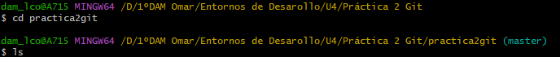

2. Cread la carpeta "unidades". 

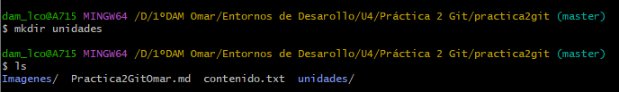

3. Cread 2 Ramas, Windows y Ubuntu.

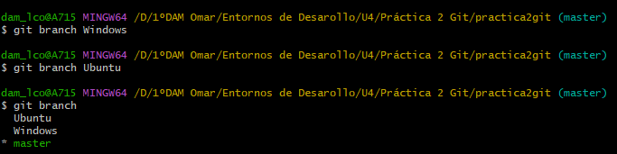

4.  Situaos en Windows y dentro de ella cread un fichero llamado windows1.txt con el siguiente texto:
```
Windows es el nombre de una familia de distribuciones de software para PC, teléfonos inteligentes, servidores y sistemas empotrados, desarrollados y vendidos por Microsoft y disponibles para múltiples arquitecturas, tales como x86, x86-64 y ARM.
```
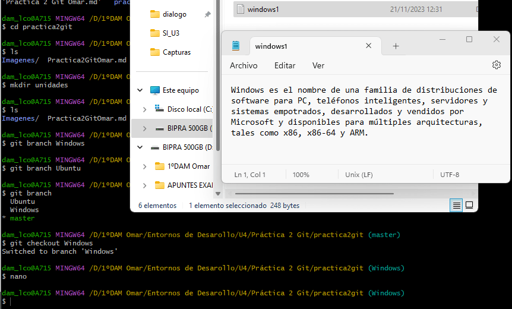

Está hecho con consola, pero lo muestro así para que se vea en la imagen.

5. Añadid los cambios realizados a la zona de preparado

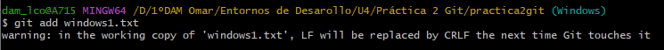

6. Haced un commit con el comentario "Añadido fichero windows1"

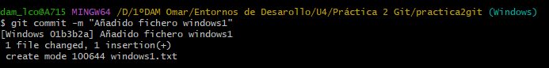

7. Mostrad de nuevo el historial de cambios del repositorio + push


8. Cambiad a la rama Ubuntu y dentro de ella cread un fichero llamado ubuntu1.txt con el siguiente texto:
```
Ubuntu es una distribución GNU/Linux basada en Debian GNU/Linux, que incluye principalmente software libre y de código abierto. Puede utilizarse en ordenadores y servidores. Está orientado al usuario promedio, con un fuerte enfoque en la facilidad de uso y en mejorar la experiencia del usuario.
```

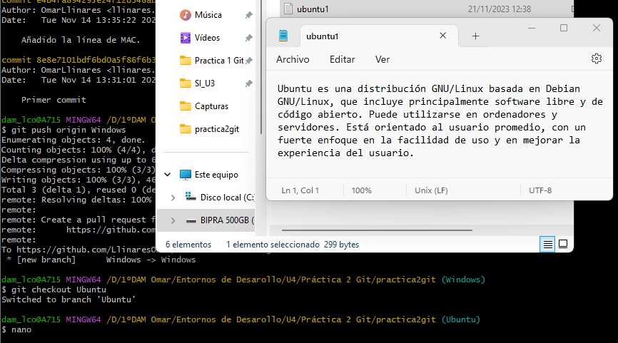

Está hecho con consola, pero lo muestro así para que se vea en la imagen.

9. Añadid los cambios realizados a la zona de preparado


10. Haced un commit con el comentario "Añadido fichero ubuntu1"


11. Mostrad de nuevo el historial de cambios del repositorio + push

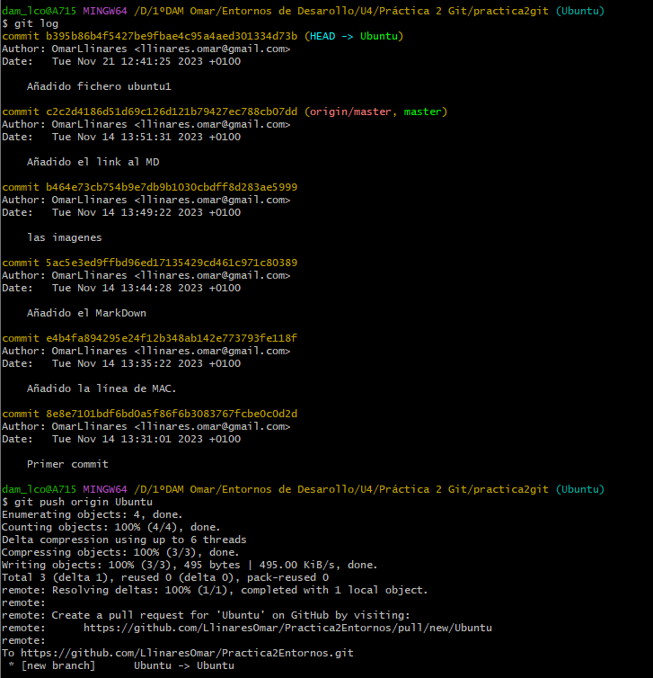

12. Volved a Windows y cread el fichero "windows2.txt" dentro de "unidades" con el texto:
````
Desde un punto de vista técnico, no son sistemas operativos, sino que contienen uno (tradicionalmente MS-DOS, o el más actual cuyo núcleo es Windows NT) junto con una amplia variedad de software; no obstante, es usual (aunque no necesariamente correcto) denominar al conjunto como sistema operativo en lugar de distribución. Microsoft introdujo un entorno operativo denominado Windows el 20 de noviembre de 1985 como un complemento para MS-DOS en respuesta al creciente interés en las interfaces gráficas de usuario (GUI).2​ Microsoft Windows llegó a dominar el mercado mundial de computadoras personales, con más del 90 % de la cuota de mercado, superando a Mac OS, que había sido introducido en 1984.

````
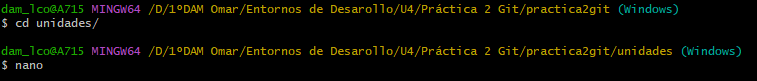

13. Añadid los cambios a la zona de preparado

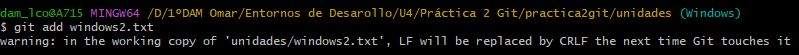

14. Haced commit de cambios con el comentario "añadido windows2.txt"

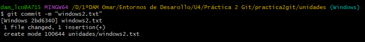

15. Mostrad las diferencias entre los dos últimos commits de esta rama.

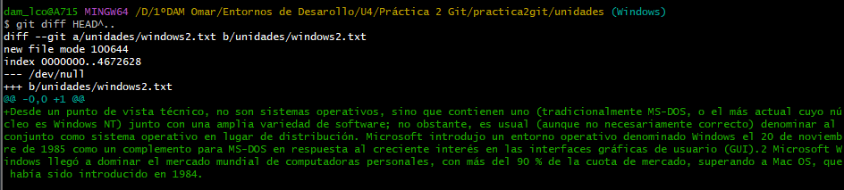

16. Añadid al fichero windows2.txt las lineas:
```
La versión más reciente de Windows es Windows 10 para equipos de escritorio, Windows Server 2019 para servidores y Windows 10 Mobile para dispositivos móviles. La primera versión en español fue Windows 2.1.
```
17. Añadid los cambios a la zona de preparado

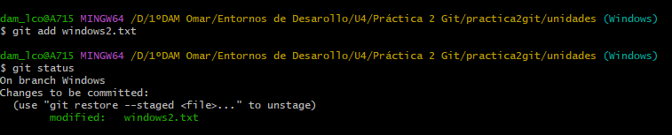

18. Haced commit de los cambios con el comentario "Añadidas versiones a windows2.txt"

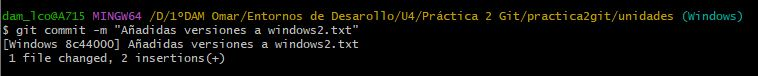

19. Mostrad quien ha hecho cambios en el fichero windows2.txt

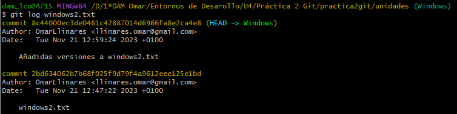


20. Situaos en Master y haced merge para que quede todo en una única rama.

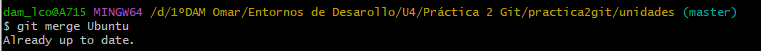

21. Borrad las 2 ramas restantes

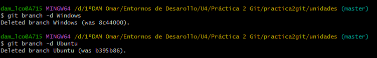

22. Descargad el programa SourceTree y añadid el repositorio con el que estais trabajando para ver el eje cronológico

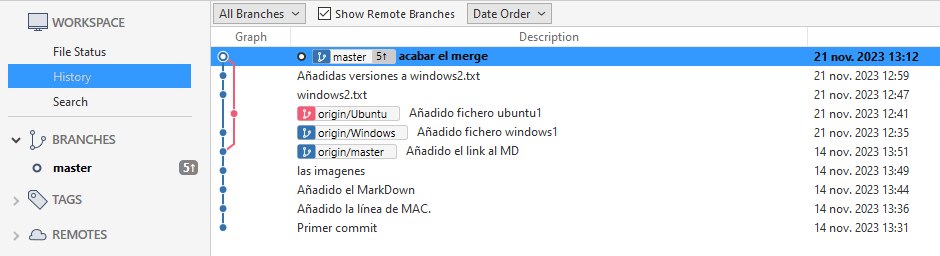
